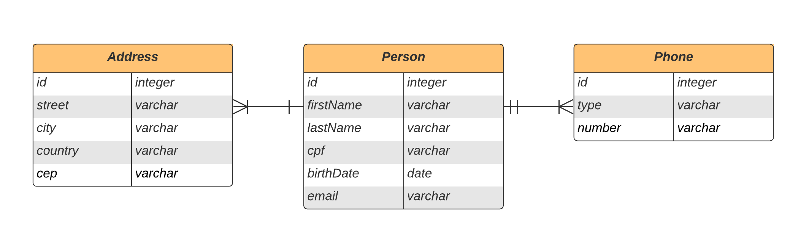

# REST API project using Spring Boot: People personal information management

#### **_Project developed as part of Bootcamp Java #2, by <a href="https://digitalinnovation.one/">Digital Innovation One</a> and <a href="https://www.linkedin.com/company/gft-group/">GFT Group</a>._**

### Overview

The purpose of this project was to develop an API REST using Spring Framework for managing people personal data and contact information, e.g. phone numbers and addresses.

### Data Structure

An overview of data structure and relationships is presented on the following ERD:



### Functionalities Implemented

- [x] Create, read, update and delete services for people data, through a REST API with **Level Two** maturity according to Richardson Maturity Model;
- [x] Data validation decoupled from entities using DTO pattern;
- [x] Validation of data fields listed below using pattern/regex before persistence:
  - [x] Email
  - [x] Phone Number
  - [x] CEP
- [x] Persistence of all people data received through API HTTP requests;
- [x] Unit tests for create person service;
- [x] Configuration of two exchangeable environments: DEV and PROD;

### Dependencies

Spring Boot project was created using Spring Initializr. Required dependencies are listed below and can also be found on this [link](https://start.spring.io/#!type=maven-project&language=java&platformVersion=2.5.2.RELEASE&packaging=jar&jvmVersion=11&groupId=com.projects.dev.tulio&artifactId=simple-res-crud-api&name=simple-res-crud-api&description=Simple%20resource%20CRUD%20API%20using%20Spring%20Boot&packageName=com.projects.dev.tulio.simple-res-crud-api&dependencies=devtools,lombok,web,data-jpa,actuator,h2):
- Spring Web
- Spring Data JPA
- Lombok
- PostgreSQL Driver
- Spring Boot DevTools
- H2 Database
- Spring Boot Actuator

External dependencies required for this project:
- [Mapstruct](https://mapstruct.org/) (mapping between entities and DTO classes)

### Execution

For running the project locally, simply type the following command on a terminal:

- **Development** profile:
```shell script
mvn spring-boot:run -Dspring-boot.run.profiles=dev
```

- **Production** profile:
```shell script
mvn spring-boot:run -Dspring-boot.run.profiles=prod
```
> **_NOTE:_** Remember to change the **prod** configuration file using your own production environment settings.

After application is running, open your preferred web browser and visit the following address to access the API:

- API endpoint: [http://localhost:8080/api/v1/people](http://localhost:8080/api/v1/people)

### Testing

For running the complete test suite, just run the following command:

```shell script
mvn clean test
```

### Technologies Used

- Java 11 (development language);
- Maven (dependency management); 
- Intellj IDEA Community Edition (IDE);
- Git and GitHub (source code versioning control);
- H2 database (in-memory persistence on DEV environment);
- PostgreSQL database (persistence on PROD environment);
- Heroku cloud-platform (application deployment);

### Acknowledgments

Many thanks to [Digital Innovation One](https://www.linkedin.com/company/digitalinnovation-one/) and [GFT Group](https://www.linkedin.com/company/gft-group/) for this great course, which provided the foundations for developing this project!

Special thanks also for the course instructors:
- [instructor1](instructor1)

### Useful Links

- [Intellij Shortcuts Pallete](https://resources.jetbrains.com/storage/products/intellij-idea/docs/IntelliJIDEA_ReferenceCard.pdf)
- [Spring Official Site](https://spring.io/)
- [JUnit 5 Official Site](https://junit.org/junit5/docs/current/user-guide/)
- [Mockito Official Site](https://site.mockito.org/)
- [Tests with Spring Boot](https://www.baeldung.com/spring-boot-testing)
- [REST Architectural Standard Reference](https://restfulapi.net/)
- [Richardson Maturity Model](https://restfulapi.net/richardson-maturity-model/)
- [Martin Fowler's Test Pyramid](https://martinfowler.com/articles/practical-test-pyramid.html#TheImportanceOftestAutomation)
- [Spring Boot App Deploy on Heroku](https://devcenter.heroku.com/articles/deploying-spring-boot-apps-to-heroku)